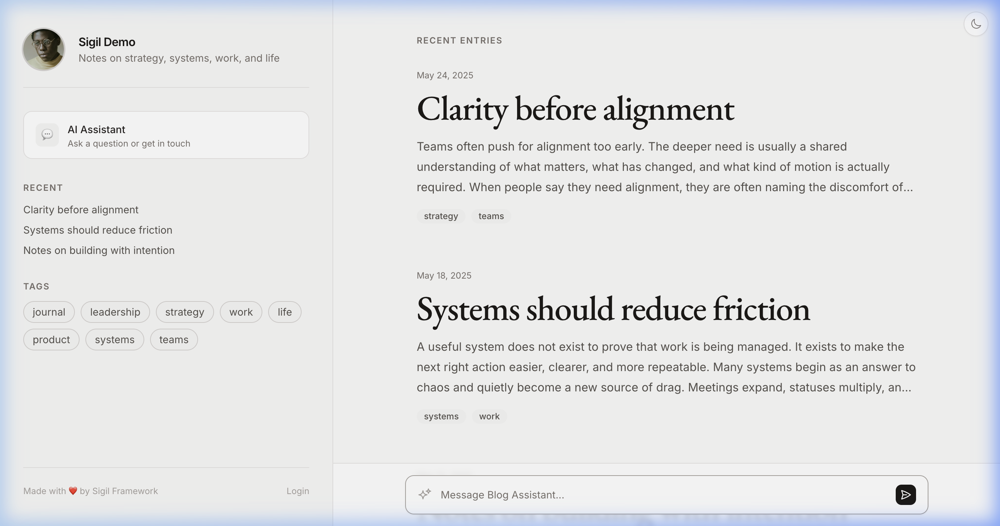
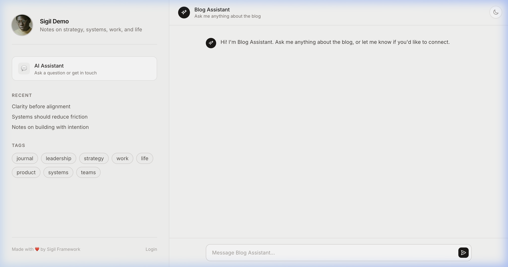

# Sigil

[](https://hex.pm/packages/sigil)
[](https://hex.pm/packages/sigil)
[](https://hexdocs.pm/sigil)
[](https://github.com/sigilframework/sigil/actions/workflows/ci.yml)
[](LICENSE)

An experimental Elixir framework for building AI agents.

*I wanted to see what AI agents look like when built on the BEAM — Erlang's runtime for fault-tolerant, concurrent systems. Sigil is what came out of that. It gives you agents, memory, tools, real-time UI, and auth as composable layers. Early stage, actively evolving.*

[Docs](https://hexdocs.pm/sigil) · [GitHub](https://github.com/sigilframework/sigil)

<p>
  
  
  
</p>

<sub>Blog with integrated AI chat · Streaming chat assistant · Admin dashboard — all from <code>mix sigil.new</code></sub>

---

## Try it (Docker)

Spin up the example app without installing Elixir. Takes about 30 seconds.

```bash
git clone https://github.com/sigilframework/sigil.git --depth 1 && cd sigil/demo && docker compose up
```

Open [localhost:4000](http://localhost:4000). You'll see a blog with an AI chat assistant and an admin dashboard.

**Admin login:** `admin@example.com` / `admin123`

> **Want to build on it?** See [Getting Started](#getting-started) below to install Elixir and create your own app.

---

## What Sigil is

### The framework — composable layers

Add `{:sigil, "~> 0.1.4"}` to any Elixir project. You get six layers:

| Layer | What it does |
|-------|-------------|
| **Sigil.LLM** | Unified interface to Claude, GPT — swap models by changing config |
| **Sigil.Tool** | Define actions agents can take (API calls, database writes, anything) |
| **Sigil.Memory** | Context windows, token budgeting, progressive summarization |
| **Sigil.Agent** | Long-running OTP processes with checkpointing and crash recovery |
| **Sigil.Live** | Real-time server-rendered UI over WebSocket — ~2KB client, no React |
| **Sigil.Auth** | Users, login, sessions, protected routes |

Use any layer independently, or all of them together. [Full API docs →](https://hexdocs.pm/sigil)

### The starter app — something to poke at

`mix sigil.new` generates a working app — a blog with AI chat — so you can see how the pieces fit together. It's meant as a starting point, not a final product.

```bash
mix sigil.new my_app
```

```bash
cd my_app && mix setup && mix sigil.server
```

Open `localhost:4000`. You get:

- A blog with a rich text editor
- AI chat assistant with streaming responses
- Multi-agent routing (add agents from the admin UI)
- Calendar tools (agents can book meetings, check availability)
- Admin dashboard for managing agents, tools, posts, conversations
- Auth, sessions, protected routes
- Dockerfile + Render config for deploying

> **Live Example:** [adambouchard.com](https://adambouchard.com) runs on Sigil — it's the starter app customized as a personal blog.

> **New to Elixir?** See the [full setup walkthrough](#getting-started) below.

---

## What `mix sigil.new` generates

```
my_app/
├── lib/my_app/
│   ├── live/                  # Chat, blog, admin views
│   │   ├── chat_live.ex       # Streaming AI chat
│   │   ├── home_live.ex       # Blog homepage
│   │   └── admin/             # Dashboard, agents, posts, settings
│   ├── schemas/               # Ecto schemas (posts, conversations, etc.)
│   ├── tools/                 # Agent tools (calendar, booking)
│   ├── generic_agent.ex       # One module powers all agents
│   ├── router.ex              # Routes with auth guards
│   └── layout.ex              # Full HTML layout with dark mode
├── priv/
│   ├── repo/migrations/       # DB schema (one migration)
│   ├── repo/seeds.exs         # Sample data + agent configs
│   └── static/css/            # Design system
├── config/                    # Dev, test, prod, runtime
├── Dockerfile                 # Production-ready container
└── render.yaml                # One-click deploy to Render
```

Agents are configured in the database — change a system prompt, swap a model, assign tools from the admin UI. No restart needed.

---

## Why Elixir for this?

This is the part I find interesting. Elixir runs on the BEAM — the Erlang VM — which was built for telecom systems that can't go down. It turns out a lot of the problems you hit building AI agents are problems the BEAM solved decades ago:

- **Agents as processes.** Each agent gets its own lightweight process (~2KB). They stay alive between conversations. No cold starts, no Redis queues — an agent is just a process that runs.
- **Crash recovery.** If something breaks, the supervisor restarts it from the last checkpoint. Conversations don't get lost.
- **Concurrency for free.** Thousands of agents, chats, and users running simultaneously in isolated processes. The BEAM schedules them.
- **Real-time built in.** WebSocket connections are just processes too. Streaming chat responses doesn't require any special infrastructure.


---

## Getting Started

### 1. Install prerequisites

You need three things:

- **Elixir 1.18+** (includes `mix`, the build tool)
- **Erlang/OTP 27+** (installed automatically with most Elixir installers)
- **PostgreSQL 14+** (must be running locally)

```bash
# macOS with Homebrew
brew install elixir
```

```bash
# Or with mise (recommended for version management)
mise install elixir@1.18 erlang@27
```

For other platforms, see the [Elixir install guide](https://elixir-lang.org/install.html). For PostgreSQL, see the [PostgreSQL downloads](https://www.postgresql.org/download/).

You'll also need an [Anthropic API key](https://console.anthropic.com/) for AI chat.

### 2. Install the Sigil generator

```bash
mix archive.install hex sigil
```

This installs the `mix sigil.new` command globally. One time setup.

### 3. Create your app

```bash
mix sigil.new my_app
```

The generator will ask for your Anthropic API key and save it to `.env`.

### 4. Set up and run

```bash
cd my_app
```

```bash
mix setup
```

This installs dependencies, creates the PostgreSQL database, runs migrations, and seeds sample data. **PostgreSQL must be running** for this step.

```bash
mix sigil.server
```

Open [localhost:4000](http://localhost:4000). You're running.

**Admin login:** `admin@example.com` / `admin123`

### Add to an existing Elixir project

```elixir
# mix.exs
def deps do
  [
    {:sigil, "~> 0.1.4"},

    # Optional — add only what you need:
    {:bandit, "~> 1.6"},           # Web server (for Sigil.Live)
    {:ecto_sql, "~> 3.12"},       # Database (for persistence)
    {:postgrex, "~> 0.19"},       # PostgreSQL
  ]
end
```

```elixir
# config/runtime.exs
config :sigil,
  anthropic_api_key: System.get_env("ANTHROPIC_API_KEY")
```

---

## Current Status

This is an early-stage project. Some things work well, some are rough around the edges.

**Works well:**
- Multi-agent teams with shared memory
- Progressive context compression
- Event sourcing and checkpointing
- Real-time UI (Sigil.Live)
- DB-driven agent configuration
- Admin dashboard
- `mix sigil.new` app generator
- Token usage tracking

**Early / experimental:**
- Plugin ecosystem on Hex
- Agent templates (support bot, content writer)

**Planned:**
- OpenAI provider
- Hosted deployments

**Live:** [adambouchard.com](https://adambouchard.com) — a personal blog running on Sigil in production

---

## Community

- [GitHub Discussions](https://github.com/sigilframework/sigil/discussions) — ideas, questions, feedback

## License

MIT — see [LICENSE](LICENSE) for details.
